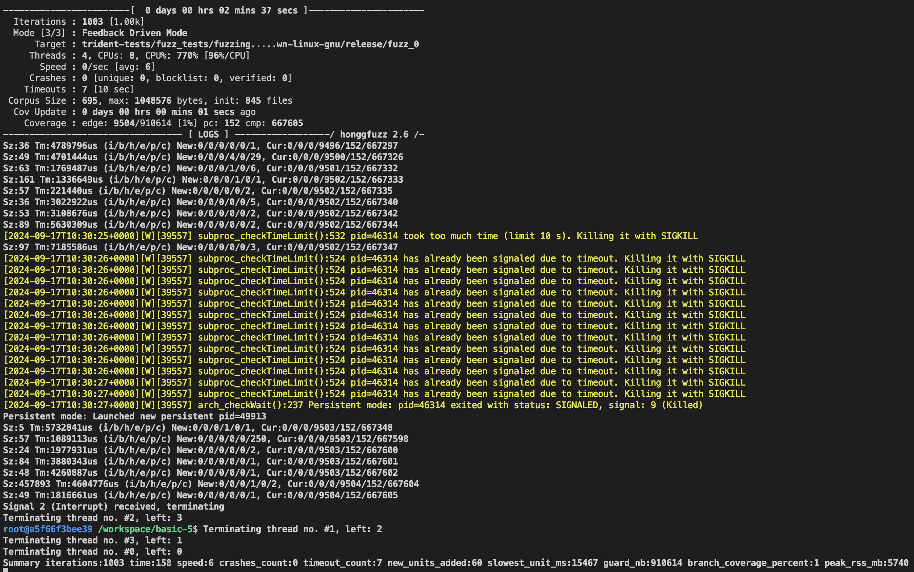

# Project Fuzzing

## Overview

This project conducts fuzz testing on a Solana program to identify vulnerabilities and ensure its robustness. Utilizing Honggfuzz, we performed extensive tests to uncover crashes and unexpected behaviors within the application.

## Fuzz Testing Process

- **Fuzzer Used:** Honggfuzz
- **Configuration:**
  - **Mutations Per Run:** 6
  - **Timeout:** 10 seconds per run
  - **Fuzz Target:** `hfuzz_target/aarch64-unknown-linux-gnu/release/fuzz_0`
- **Execution Details:** Generated multiple input files to simulate various edge cases and input scenarios.

## Implemented Fuzz Tests

- Crafted inputs targeting different functionalities of the Solana program to trigger boundary conditions, unexpected states, and potential buffer overflows.

## Report

